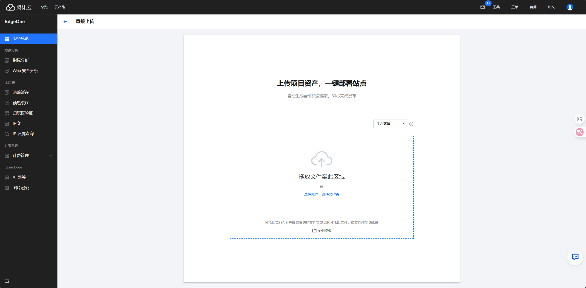

# 开始实现

> 源码： [GithubSiteProxyForCloudflareWorker/eopf.js at main · afoim/GithubSiteProxyForCloudflareWorker](https://github.com/afoim/GithubSiteProxyForCloudflareWorker/blob/main/eopf.js)

首先请阅读 [这篇文章](/posts/gh-proxy/) 知晓大致原理。因为EdgeOne Page Function的写法跟Cloudflare Worker差不多

下载 https://r2.072103.xyz/github-eopf.zip 并解压

目录结构为


这里面的每一个JS文件的内容都相同，所以如果需要改请全都改一遍

打开任意一个JS文件，更改域名映射配置

```js
// 域名映射配置
const domain_mappings = {
  'github.com': 'gh.',
  'avatars.githubusercontent.com': 'avatars-githubusercontent-com.',
  'github.githubassets.com': 'github-githubassets-com.',
  'collector.github.com': 'collector-github-com.',
  'api.github.com': 'api-github-com.',
  'raw.githubusercontent.com': 'raw-githubusercontent-com.',
  'gist.githubusercontent.com': 'gist-githubusercontent-com.',
  'github.io': 'github-io.',
  'assets-cdn.github.com': 'assets-cdn-github-com.',
  'cdn.jsdelivr.net': 'cdn.jsdelivr-net.',
  'securitylab.github.com': 'securitylab-github-com.',
  'www.githubstatus.com': 'www-githubstatus-com.',
  'npmjs.com': 'npmjs-com.',
  'git-lfs.github.com': 'git-lfs-github-com.',
  'githubusercontent.com': 'githubusercontent-com.',
  'github.global.ssl.fastly.net': 'github-global-ssl-fastly-net.',
  'api.npms.io': 'api-npms-io.',
  'github.community': 'github-community.'
};
```

然后上传到EdgeOne Pages



按照前缀绑定域名


# 为什么结构目录这么抽象？

- 为什么要放一个 `index.html` ？并且里面是空的？：因为不放就404

- 为什么要放一个 `index.js` 和 `[[default.js]]` ？：因为 `index.js` 负责 `/` 的路由，`[[default.js]]` 负责 `/*` 的路由

- 
